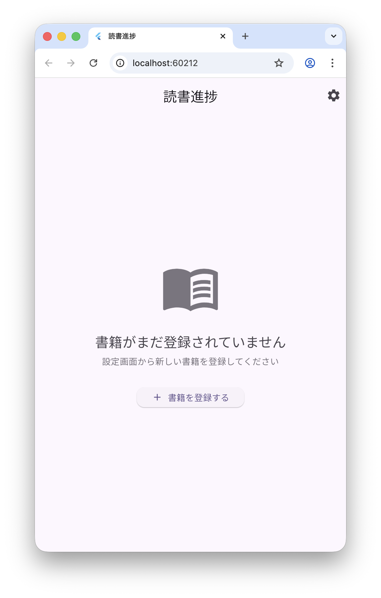
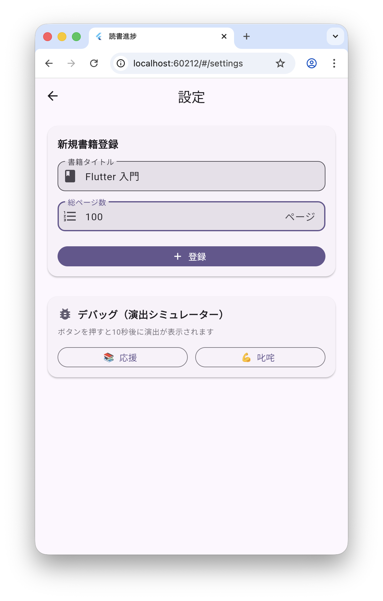
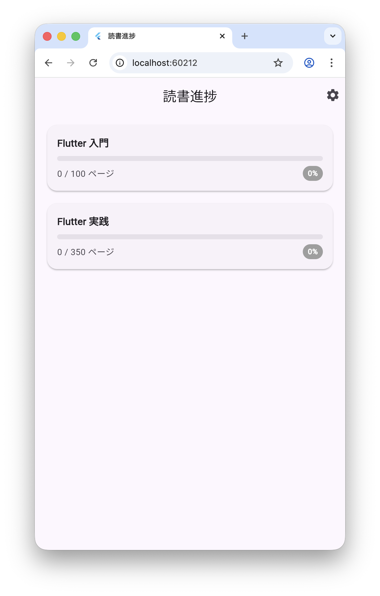
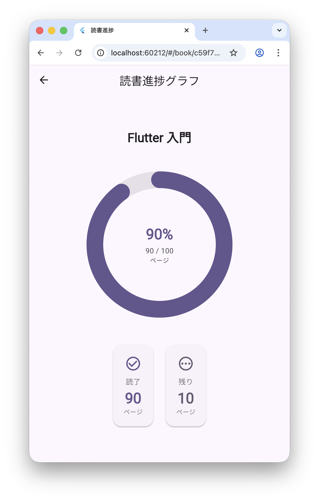

# reading_progress_app
Antigravity を使った Flutter アプリ開発のサンプルプロジェクト。(Opus Model)

_このプロジェクトは、[FlutterKaigi 2025 ハンズオンリポジトリ](
https://github.com/FlutterKaigi/conference-handson-2025) のアプリ要件を参考にしています。_

## 開発手順

### 1. アプリ要件定義書を作成する
- 初期設定
  - [.agent/rules/rules.md](.agent/rules/rules.md) ⇒ 一般的な Flutter プロジェクトのルール
  - [.agent/rules/sample-workspace-rule.md](.agent/rules/sample-workspace-rule.md) ⇒ このワークスペース全体のルール
  - [.agent/workflows/create-project.md](.agent/workflows/create-project.md) ⇒ Flutter プロジェクト作成の作業定義
  - [docs/specification/App-Specification.md](docs/specification/App-Specification.md) ⇒ アプリの要件定義書
  - 【備考】Flutter and Dart MCP Server を Global MCP Server として利用します。  

### 2. Flutter アプリプロジェクト作成
- Agent モデルを Opas 4.5 に指定する。
- create-project workflow を実行して、[アプリ要件定義書](docs/specification/App-Specification.md)を参考にプロジェクトを作成。

### 3. 補足
- 上記２工程で、lib/ 配下の全ソースが生成された。
- ユニットテストとWidgetテストが作成されなかったので、プロンプト指定して作成させた。
- テストコード中に Analyze 指摘が含まれていたので、プロント指定して修正させた。

## アプリ画像

